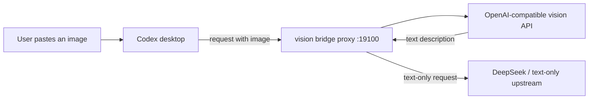

# codex-free-vision-bridge

[](LICENSE)
[](https://www.python.org/)
[](tests/)

Give text-only Codex models (DeepSeek V4, GLM, MiMo) image understanding through a free OpenAI-compatible vision API. The vision model converts images into text; the main model keeps reasoning. No Ollama, no GPU, no model swap.

**English** | [中文](README.zh-CN.md)

## Features

- Single-file Python, zero third-party dependencies
- `see` CLI for on-demand image analysis and OCR-style questions
- Local strip proxy that rewrites pasted images into text before they reach the text-only upstream
- Pluggable vision providers: built-in presets, custom `providers.json`, or plain `.env` overrides
- Works with any OpenAI-compatible vision API; Zhipu `glm-4v-flash` (free) is the default
- Passes the original Authorization header through, so the main model key stays in Codex config
- Per-image + prompt cache, fail-open behavior, UTF-8 safe on Windows
- Verified end-to-end: Codex desktop + DeepSeek V4 Flash + pasted screenshot

## Architecture



`see` mode skips the proxy: the image path is sent directly to the vision API and the returned text is used by the agent.

## Quick Start

### Agent-driven setup (recommended)

No terminal or programming skills are required. Paste this into your AI agent:

```text
Set up codex-free-vision-bridge for me. Read AGENT_INSTALL.md and follow it end to end. Use the free Zhipu provider unless I choose another one.
```

The agent will configure the provider, verify the pipeline, enable Codex pasted screenshots with backups, and report what it changed.

### Prerequisites

- Python 3.8+
- An OpenAI-compatible vision API key (Zhipu `glm-4v-flash` is free)

### 1. Configure `.env`

```bash
copy .env.example .env        # Windows
cp .env.example .env          # macOS / Linux
```

```bash
VISION_API_KEY=your-full-key
VISION_BASE_URL=https://open.bigmodel.cn/api/paas/v4
VISION_MODEL=glm-4v-flash
```

Zhipu keys use the `{API Key ID}.{secret}` format. Do not add quotes; the loader strips surrounding quotes and whitespace.

### 2. Verify the pipeline

```bash
python vision_bridge.py doctor
python vision_bridge.py see examples/sample-error-dialog.png -q "What error is shown and what is the error code?"
python vision_bridge.py see examples/sample-order-success.png -q "What is the order number and amount?"
```

`examples/` contains two generated screenshots. Correct output means the key and pipeline work.

### 3. Enable pasted screenshots in Codex

This requires editing Codex configuration. The repository never modifies those files automatically; back them up first.

1. Start the proxy:

   ```bash
   python vision_bridge.py proxy \
     --listen 127.0.0.1:19100 \
     --upstream https://api.deepseek.com
   ```

2. Point the DeepSeek provider `base_url` at the proxy in `~/.codex/config.toml`:

   ```toml
   base_url = "http://127.0.0.1:19100/v1"
   ```

3. If the desktop client rejects pasted images with "model does not support image inputs", the model catalog marks the model as text-only. Set `input_modalities` to `["text", "image"]` for the model entry (for CC Switch users: `cc-switch-model-catalog.custom.json`).

4. Fully restart Codex and paste a screenshot.

Known limitation: whether pasted images reach the API depends on the client. If the client still blocks images, use `see` mode with `SKILL.md` instead.

## Vision Providers

The bridge accepts any OpenAI-compatible vision API. Pick a built-in preset with `--provider`, or add your own without touching code.

```bash
python vision_bridge.py providers
python vision_bridge.py see screenshot.png --provider dashscope -q "extract the text"
python vision_bridge.py proxy --provider openai --upstream https://api.deepseek.com
```

| Provider | Model examples | Cost |
|---|---|---|
| Zhipu | `glm-4v-flash`, `glm-4.6v-flash` | Free |
| Alibaba DashScope | `qwen-vl-max`, `qwen3-vl-flash` | Pay-as-you-go / free quota |
| OpenAI | `gpt-4o-mini`, `gpt-4o` | Pay-as-you-go |
| Google Gemini | `gemini-2.0-flash` | Free tier available |
| Groq | Qwen vision models | Free plan available |
| SiliconFlow | Qwen2.5-VL series | Free quota for new users |
| Self-hosted vLLM / Ollama | any VLM | Hardware only |

### Add your own provider

You do not need to write files yourself. Ask your agent to add a provider; it creates `providers.json` next to `vision_bridge.py` from `providers.example.json`:

```json
{
  "providers": [
    {
      "id": "my-provider",
      "base_url": "https://your-api.example.com/v1",
      "model": "your-vision-model",
      "cost": "your pricing note"
    }
  ]
}
```

Then use `--provider my-provider`. Entries in `providers.json` override built-in presets with the same id. If you prefer no config file, `VISION_BASE_URL`, `VISION_MODEL` and `VISION_API_KEY` in `.env` are always honored.

## Configuration

| Variable | Default | Description |
|---|---|---|
| `VISION_API_KEY` | - | Vision API key (required) |
| `VISION_BASE_URL` | `https://open.bigmodel.cn/api/paas/v4` | OpenAI-compatible endpoint |
| `VISION_MODEL` | `glm-4v-flash` | Vision model name |

## CLI Reference

```bash
# On-demand image analysis
python vision_bridge.py see <image>... [-q "question"] [--model MODEL] [--base-url URL] [--api-key KEY] [--no-cache]

# Local image-strip proxy
python vision_bridge.py proxy --listen 127.0.0.1:19100 --upstream <origin>

# Configuration check
python vision_bridge.py doctor

# List available provider presets
python vision_bridge.py providers
```

## Testing

```bash
python -m unittest discover -s tests -v
```

## Troubleshooting

- **HTTP 429**: the free model is rate limited; retries are built in, or switch to another model.
- **Garbled Chinese output on Windows**: the script forces UTF-8 on stdout/stderr; run `chcp 65001` or set `PYTHONIOENCODING=utf-8` for other tools.
- **Vision API unreachable**: check `HTTP_PROXY` / `HTTPS_PROXY`; `urllib` reads them by default.
- **Pasted image still rejected**: the client rejected the image before the proxy saw it; check the model catalog `input_modalities` or use `see` mode.
- **Vision service failure**: proxy mode fails open and forwards the original request unchanged.

## Privacy & Security

Images are sent only to the configured vision provider (Zhipu by default). Review the provider policy before sending sensitive screenshots. `.env` is gitignored; never commit or share it.

## Roadmap

- Multi-provider fallback and health-based routing
- Client-side hooks fallback for clients that reject pasted images
- CI pipeline for unit tests
- More free vision backends

## License

MIT
