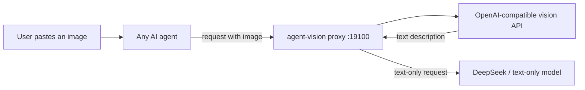

# codex-deepseek-vision

[](LICENSE)
[](https://www.python.org/)
[](https://github.com/SIMON-WORLD/codex-deepseek-vision/releases)

**Codex vision bridge for DeepSeek V4 Flash and other text-only models.** Package/CLI: `agent-vision`. DeepSeek V4 Flash now speaks the Responses protocol and runs inside Codex/ChatGPT, but the model itself is text-only and cannot see images. agent-vision is a free local vision proxy: pasted images and `view_image` calls are converted into text through an OpenAI-compatible vision API (free GLM-4V-Flash by default) before DeepSeek reasons. No Ollama, no GPU, no model swap.

**English** | [中文](README.zh-CN.md)

## Why

Text-only agents cannot see pasted screenshots, local images, charts, or error dialogs. Replacing the model usually means paying more or changing your whole workflow. agent-vision sits between the agent and its model provider and does the conversion automatically:

- Paste an image in your agent, and the local proxy rewrites it into text before the request reaches the text-only model.
- Ask the agent to inspect a local image, an image URL, or the latest image you pasted (`see --latest`), and it returns a factual description.
- Keep your existing model, key, and workflow. Everything is local, reversible, and free by default.

## Architecture



`see` mode skips the proxy: the image path is sent directly to the vision API and the returned text is used by the agent.

## Supported Agents

| Agent | Integration | Status |
|---|---|---|
| Codex | Safe auto-patch: rewrites only the active provider's `base_url` to the local proxy, keeps `wire_api` and keys, and declares image input for the active model in a local model catalog (e.g. cc-switch) when present so pasted images and `view_image` are allowed; backup and rollback; `see --latest` recovers the last pasted image as a fallback | Fully automatic |
| OpenCode | Auto-patches `opencode.json` with an OpenAI-compatible provider | Fully automatic |
| Claude Code | Detected and guided; Claude speaks the Anthropic protocol, so a protocol-compatible gateway is required | Manual steps provided |
| Cursor | Detected and guided; Cursor exposes the base URL override only through Settings -> Models | Manual steps provided |

## Supported Vision Providers

agent-vision accepts any OpenAI-compatible vision API. Built-in presets cover the most common ones; custom endpoints work too.

| Provider | Model examples | Cost |
|---|---|---|
| [Zhipu](https://open.bigmodel.cn/) | `glm-4v-flash`, `glm-4.6v-flash` | Free |
| [Alibaba DashScope](https://bailian.console.aliyun.com/) | `qwen-vl-max`, `qwen3-vl-flash` | Pay-as-you-go / free quota |
| [OpenAI](https://platform.openai.com/api-keys) | `gpt-4o-mini`, `gpt-4o` | Pay-as-you-go |
| [Google Gemini](https://aistudio.google.com/apikey) | `gemini-2.0-flash` | Free tier available |
| [Groq](https://console.groq.com/) | Qwen vision models | Free plan available |
| [SiliconFlow](https://cloud.siliconflow.cn/) | Qwen2.5-VL series | Free quota for new users |
| [OpenRouter](https://openrouter.ai/) | Free and paid vision models | Mixed |
| Self-hosted vLLM / Ollama | Any VLM | Hardware only |

Click a provider name to open its official sign-up/console page and create an API key.

## Install

### One-line deploy (recommended)

Paste this into your AI agent:

```text
Deploy agent-vision from https://github.com/SIMON-WORLD/codex-deepseek-vision per AGENT_INSTALL.md. Use the free Zhipu provider. Vision API key: <KEY>. Tell me when I need to restart Codex.
```

### One-line install (recommended)

Install Python 3.9+, then run:

```bash
pip install codex-deepseek-vision
agent-vision setup
```

If PyPI is unreachable, install from the repository instead:

```bash
git clone https://github.com/SIMON-WORLD/codex-deepseek-vision.git
cd codex-deepseek-vision
pip install .
agent-vision setup
```

The wizard detects your agent, lets you pick Free / Quality / Custom vision, writes the config with a backup, starts the local runtime, verifies the connection, and prints the final health status. For Codex it only rewrites the active provider's `base_url`; `model_provider`, `model`, `wire_api` and API keys are left untouched.

You can also paste this into your agent and let it do the work:

```text
Set up agent-vision for me. Read AGENT_INSTALL.md and follow it end to end. Use the free Zhipu provider unless I choose another one.
```

All user configuration lives in one directory: `~/.agent-vision/` on Linux/macOS, `%USERPROFILE%\.agent-vision\` on Windows. Override it with `AGENT_VISION_HOME` if you prefer another location. The setup wizard creates and fills this directory automatically.

### Runtime management

```bash
agent-vision start      # start the local vision proxy in the background
agent-vision status     # show installation, runtime, provider, agent and vision status
agent-vision restart    # restart the local proxy
agent-vision stop       # stop the local proxy
agent-vision autostart --enable   # Windows: start the proxy automatically at login (run once)
agent-vision autostart --status   # show whether autostart is enabled
agent-vision autostart --disable  # remove the login autostart entry
```

### Rollback

```bash
agent-vision rollback codex
agent-vision rollback opencode
```

Every auto-patch creates a timestamped backup before modifying anything, and `rollback` restores it.

## Configuration

`agent-vision setup` writes and manages `.env` inside the user config directory. For manual configuration, copy `.env.example` to `~/.agent-vision/.env` (Windows: `%USERPROFILE%\.agent-vision\.env`) and fill in the vision API key. Zhipu keys use the `{API Key ID}.{secret}` format. Do not add quotes; the loader strips surrounding quotes and whitespace.

| Variable | Default | Description |
|---|---|---|
| `VISION_API_KEY` | - | Vision API key (required) |
| `VISION_BASE_URL` | `https://open.bigmodel.cn/api/paas/v4` | OpenAI-compatible endpoint |
| `VISION_MODEL` | `glm-4v-flash` | Vision model name |
| `VISION_PROXY_UPSTREAM` | - | Optional: URL the local proxy forwards to |
| `VISION_PROXY_LISTEN` | `127.0.0.1:19100` | Optional: local proxy listen address |

For a custom provider, ask your agent to add one to `providers.json` in the user config directory; no code changes are needed. Entries there override built-in presets with the same id.

## CLI Reference

```bash
# Analyze images on demand (local file, image URL, or latest pasted image)
agent-vision see <image-or-url>... [-q "question"] [--task describe|ocr|ui|chart] [--latest] [--provider ID] [--no-cache]

# Run the local image-strip proxy in the foreground
agent-vision proxy --listen 127.0.0.1:19100 --upstream <origin>

# Guided setup
agent-vision setup [--agent codex|opencode|claude|cursor] [--dry-run]

# Health status
agent-vision status [--test]

# Runtime lifecycle
agent-vision start | restart | stop

# Configuration check
agent-vision doctor

# List vision provider presets
agent-vision providers
```

## Self-test in 3 minutes

Anyone with Python 3.9+ can verify the bridge on a fresh machine:

```bash
git clone https://github.com/SIMON-WORLD/codex-deepseek-vision.git
cd codex-deepseek-vision
pip install .
agent-vision setup
agent-vision status
```

Then paste an image in Codex or ask the agent to call `view_image` on a local image. For a zero-setup fresh machine, open this repository in GitHub Codespaces: the devcontainer pre-installs the package, and all commands above run the same way.

## Testing

```bash
python -m unittest discover -s tests -v
```

## FAQ

- **Do I need a GPU or Ollama?** No. Vision is handled by a remote OpenAI-compatible API; the default Zhipu `glm-4v-flash` is free.
- **Is my agent key exposed?** No. The proxy passes the original Authorization header through, so your main model key stays in the agent's existing config.
- **Why does Codex still refuse pasted images ("model does not support image input")?** Codex decides whether the UI accepts pasted images from its model catalog. When you load models from a local catalog (e.g. cc-switch's `model_catalog_json`), `setup` now also declares image input for the active text-only model (with a timestamped backup; `rollback codex` restores it). If you switch models with cc-switch afterwards, that file may be regenerated — rerun `agent-vision setup` to re-apply.
- **Can the agent call Codex's built-in `view_image`?** Pasted images work through the proxy. The built-in `view_image` tool, however, is limited on the current Codex desktop build: the client replaces its result with `[Unsupported Image]` before it reaches the proxy. For local files, use `agent-vision see <path>` (or `agent-vision see --latest` for the last pasted image).
- **Can I use a paid provider?** Yes. Choose Quality or Custom in setup, or edit `.env` / `providers.json`.
- **What happens if the vision API fails?** After retries, the proxy replaces the image with a visible failure marker (`[image vision conversion failed: <reason>]`) instead of forwarding the raw image, so the agent can ask the user to re-paste. Failure reasons are logged to `~/.agent-vision/logs/proxy.log`.
- **Codex fails with `stream disconnected` after a reboot?** The local proxy is not running yet. Run `agent-vision start`, or run `agent-vision autostart --enable` once so the proxy starts automatically at login. If you already changed `base_url` back to the upstream, rerun `agent-vision setup` to re-enable the vision bridge.
- **Are images private?** Images are sent only to the provider you configure (Zhipu by default). Review the provider policy before sending sensitive screenshots. `see --latest` extracts only the image bytes from Codex session files and never reads or sends conversation text. `.env` is gitignored; never commit or share it.

## License

MIT
