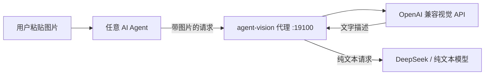

# agent-vision

[](LICENSE)
[](https://www.python.org/)
[](https://github.com/SIMON-WORLD/agent-vision/releases)

**Codex + DeepSeek V4 Flash 看图桥（vision bridge）。** DeepSeek V4 Flash 已接入 Responses 协议、可部署到 Codex/ChatGPT，但模型本身是纯文本模型，不能直接看图。agent-vision 是本地视觉代理：粘贴图片和 `view_image` 调用会先经 OpenAI 兼容视觉 API（默认免费 `glm-4v-flash`）转成文字，再交给 DeepSeek 推理。不需要 Ollama、不需要 GPU、不需要换模型。

[English](README.md) | **中文**

## 为什么需要

纯文本模型看不到你粘贴的截图、本地图片、图表和报错弹窗。换模型通常意味着更高成本或改变整个工作流。agent-vision 位于 Agent 和模型服务之间，自动完成转换：

- 在 Agent 里粘贴图片，本地代理会在请求到达纯文本模型之前把图片改写成文字。
- 让 Agent 查看本地图片、图片 URL 或你最近粘贴的图片（`see --latest`）时，`see` 命令会把图片发给视觉 API，返回可验证的事实描述。
- 保留你现有的模型、API Key 和工作流。全部本地化、可回滚，默认免费。

## 架构



`see` 模式不需要代理：直接把图片路径发给视觉 API，把返回文字交给 Agent 使用。

## 支持的 Agent

| Agent | 接入方式 | 状态 |
|---|---|---|
| Codex | 安全自动修改：只把当前活动 provider 的 `base_url` 改为本地代理，不动 `wire_api` 和 Key；若存在本地模型目录（如 cc-switch），会同时为当前模型声明图片输入，客户端才允许粘贴图片和 `view_image`；带备份和回滚；`see --latest` 可从会话文件恢复最近粘贴的图片兜底 | 全自动 |
| OpenCode | 自动在 `opencode.json` 里添加 OpenAI 兼容 provider | 全自动 |
| Claude Code | 检测并给出指引；Claude 使用 Anthropic 协议，需要协议兼容网关 | 提供手动步骤 |
| Cursor | 检测并给出指引；Cursor 只在 Settings -> Models 里提供 Base URL 覆盖开关 | 提供手动步骤 |

## 支持的视觉服务商

agent-vision 接受任意 OpenAI 兼容视觉 API。内置常见服务商预设，也支持自定义接口。

| 服务商 | 模型示例 | 费用 |
|---|---|---|
| [智谱](https://open.bigmodel.cn/) | `glm-4v-flash`, `glm-4.6v-flash` | 免费 |
| [阿里百炼](https://bailian.console.aliyun.com/) | `qwen-vl-max`, `qwen3-vl-flash` | 按量 / 免费额度 |
| [OpenAI](https://platform.openai.com/api-keys) | `gpt-4o-mini`, `gpt-4o` | 按量 |
| [Google Gemini](https://aistudio.google.com/apikey) | `gemini-2.0-flash` | 有免费层 |
| [Groq](https://console.groq.com/) | Qwen 视觉模型 | 有免费计划 |
| [硅基流动](https://cloud.siliconflow.cn/) | Qwen2.5-VL 系列 | 新用户免费额度 |
| [OpenRouter](https://openrouter.ai/) | 免费和付费视觉模型 | 混合 |
| 自部署 vLLM / Ollama | 任意 VLM | 仅硬件成本 |

点击服务商名称可直接打开官网/控制台创建 API Key。

## 安装

### 一句话部署（推荐）

把下面这句话发给你的 Agent：

```text
帮我从 https://github.com/SIMON-WORLD/agent-vision 部署 agent-vision，按 AGENT_INSTALL.zh-CN.md 执行，用免费智谱，视觉 API Key 是 <KEY>，完成后提醒我重启 Codex。
```

### 一键配置（推荐）

不需要懂终端。安装 Python 3.9+，克隆仓库后运行：

```bash
git clone https://github.com/SIMON-WORLD/agent-vision.git
cd agent-vision
pip install .
agent-vision setup
```

向导会自动检测你的 Agent，让你选择 Free / Quality / Custom 视觉服务，带备份写入配置，启动本地运行时，验证连接，最后输出健康状态。对 Codex 只改写当前活动 provider 的 `base_url`，`model_provider`、`model`、`wire_api` 和 API Key 都不动。

也可以把下面这句话发给你的 AI Agent，让它替你完成：

```text
帮我安装并配置 agent-vision。请阅读 AGENT_INSTALL.zh-CN.md 并从头到尾执行。默认使用智谱免费服务，除非我指定其他服务商。
```

所有用户配置统一放在一个目录：Linux/macOS 为 `~/.agent-vision/`，Windows 为 `%USERPROFILE%\.agent-vision\`。也可以用 `AGENT_VISION_HOME` 环境变量覆盖。setup 向导会自动创建并填写这个目录。

### 运行时管理

```bash
agent-vision start      # 后台启动本地视觉代理
agent-vision status     # 查看安装、运行时、服务商、Agent、视觉状态
agent-vision restart    # 重启本地代理
agent-vision stop       # 停止本地代理
```

### 回滚

```bash
agent-vision rollback codex
agent-vision rollback opencode
```

每次自动修改前都会先生成带时间戳的备份，`rollback` 会完整恢复。

## 配置

`agent-vision setup` 会在用户配置目录里自动写入和管理 `.env`。手动配置时，把 `.env.example` 复制为 `~/.agent-vision/.env`（Windows：`%USERPROFILE%\.agent-vision\.env`）并填写视觉 API Key。智谱 Key 格式为 `{API Key ID}.{secret}`，不需要加引号；脚本会自动去掉值两侧的引号和空格。

| 变量 | 默认值 | 说明 |
|---|---|---|
| `VISION_API_KEY` | - | 视觉 API Key（必填） |
| `VISION_BASE_URL` | `https://open.bigmodel.cn/api/paas/v4` | OpenAI 兼容接口地址 |
| `VISION_MODEL` | `glm-4v-flash` | 视觉模型名 |
| `VISION_PROXY_UPSTREAM` | - | 可选：本地代理转发的上游地址 |
| `VISION_PROXY_LISTEN` | `127.0.0.1:19100` | 可选：本地代理监听地址 |

需要自定义服务商时，让 Agent 在用户配置目录的 `providers.json` 里添加即可，不需要改代码。同 id 的条目会覆盖内置预设。

## CLI 参考

```bash
# 按需识图（本地文件 / 图片 URL / 最近粘贴的图片）
agent-vision see <图片或URL>... [-q "问题"] [--task describe|ocr|ui|chart] [--latest] [--provider ID] [--no-cache]

# 前台运行本地图片转文字代理
agent-vision proxy --listen 127.0.0.1:19100 --upstream <上游地址>

# 引导式配置
agent-vision setup [--agent codex|opencode|claude|cursor] [--dry-run]

# 健康状态
agent-vision status [--test]

# 运行时生命周期
agent-vision start | restart | stop

# 配置检查
agent-vision doctor

# 查看视觉服务商预设
agent-vision providers
```

## 测试

```bash
python -m unittest discover -s tests -v
```

## FAQ

- **需要 GPU 或 Ollama 吗？** 不需要。视觉部分由远程 OpenAI 兼容 API 完成，默认智谱 `glm-4v-flash` 免费。
- **主模型 API Key 会泄露吗？** 不会。代理原样透传 Authorization，主模型 Key 仍然只存在 Agent 原有配置里。
- **为什么 Codex 仍提示“此模型不支持图片输入”？** Codex 客户端按模型目录判断是否允许粘贴图片。若你通过本地模型目录（如 cc-switch 的 `model_catalog_json`）加载模型，`setup` 现在会同时为当前纯文本模型声明图片输入（带时间戳备份，`rollback codex` 可还原）。之后用 cc-switch 切换模型可能重新生成该目录并覆盖声明，重跑 `agent-vision setup` 即可。
- **Agent 能调用 Codex 内置的 `view_image` 吗？** 可以。`view_image` 会把本地图片放进后续请求，同一个代理会在纯文本模型看到之前转成文字。如果客户端彻底拒绝粘贴图片，可以运行 `agent-vision see --latest`，从 Codex 会话文件恢复最近粘贴的图片并直接识别。
- **可以用付费服务吗？** 可以。在 setup 里选 Quality 或 Custom，或者直接改 `.env` / `providers.json`。
- **视觉 API 挂了会怎样？** 代理模式 fail-open，原请求原样转发，不会阻塞正常聊天。
- **图片隐私如何？** 图片只会发送到你配置的服务商（默认智谱）。发送敏感截图前请先查看对方隐私政策。`see --latest` 只从 Codex 会话文件提取图片字节，不读取或发送对话文本。`.env` 已被 `.gitignore` 排除，不要提交或分享。

## License

MIT
