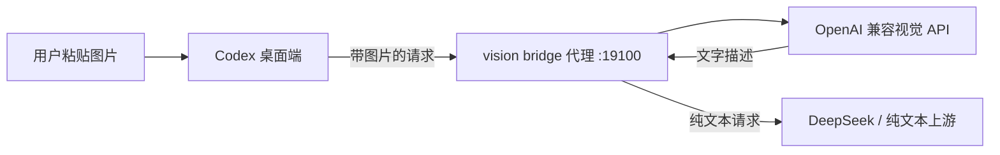

# codex-free-vision-bridge

[](LICENSE)
[](https://www.python.org/)
[](tests/)

给 Codex 里的 DeepSeek V4、GLM、MiMo 等纯文本模型补“看图”能力的免费方案：图片交给 OpenAI 兼容视觉模型转成文字，主模型只负责推理。不用 Ollama、不用 GPU、不用换模型。

[English](README.md) | **中文**

## 特性

- 单文件 Python，零第三方依赖
- `see` 命令行按需识图，可做描述、问答、OCR 式提取
- 本地剥离代理：粘贴的图片在到达纯文本上游之前自动转成文字
- 可插拔视觉服务商：内置预设、自定义 `providers.json`、或直接改 `.env`
- 支持任意 OpenAI 兼容视觉 API，默认智谱 `glm-4v-flash`（免费）
- 原样透传 Authorization，主模型 key 不用二次保存
- 按“图片+问题”缓存、fail-open 不卡聊天、Windows 下 UTF-8 安全
- 已端到端实测：Codex 桌面端 + DeepSeek V4 Flash + 粘贴截图

## 架构



`see` 模式不需要代理：直接把图片路径发给视觉 API，把返回文字交给 agent 使用。

## 快速开始

### Agent 一键配置（推荐）

不需要懂终端和编程。把下面这句话发给你的 AI Agent：

```text
帮我安装并配置 codex-free-vision-bridge。请阅读 AGENT_INSTALL.zh-CN.md 并从头到尾执行。默认使用智谱免费服务，除非我指定其他服务商。
```

Agent 会帮你配置服务商、验证链路、备份并启用 Codex 粘贴图片，最后汇报改了什么。

### 前置要求

- Python 3.8+
- 一个 OpenAI 兼容视觉 API key（推荐智谱免费 `glm-4v-flash`）

### 1. 配置 `.env`

```bash
copy .env.example .env        # Windows
cp .env.example .env          # macOS / Linux
```

```bash
VISION_API_KEY=你的完整Key
VISION_BASE_URL=https://open.bigmodel.cn/api/paas/v4
VISION_MODEL=glm-4v-flash
```

智谱 Key 格式为 `{API Key ID}.{secret}`，不需要加引号；脚本会自动去掉值两侧的引号和空格。

### 2. 验证链路

```bash
python vision_bridge.py doctor
python vision_bridge.py see examples/sample-error-dialog.png -q "这个截图里有什么错误，错误码是什么"
python vision_bridge.py see examples/sample-order-success.png -q "订单号和金额是多少"
```

`examples/` 里有两张程序生成的测试图，能准确读出内容就说明 key 和链路正常。

### 3. 在 Codex 中启用粘贴图片

这一步需要修改 Codex 配置，本仓库不会自动修改，请先备份。

1. 启动代理：

   ```bash
   python vision_bridge.py proxy \
     --listen 127.0.0.1:19100 \
     --upstream https://api.deepseek.com
   ```

2. 在 `~/.codex/config.toml` 中把 DeepSeek provider 的 `base_url` 指向代理：

   ```toml
   base_url = "http://127.0.0.1:19100/v1"
   ```

3. 如果桌面端提示“此模型不支持图片输入”，说明模型目录把该模型标成了纯文本。把对应模型条目的 `input_modalities` 改为 `["text", "image"]`（使用 CC Switch 时文件为 `cc-switch-model-catalog.custom.json`）。

4. 完全退出并重启 Codex，再粘贴截图。

已知限制：是否允许粘贴图片取决于客户端。如果客户端仍拒绝，请改用 `see` 模式并按 `SKILL.md` 配置。

## 视觉模型选择

桥接层支持任意 OpenAI 兼容视觉 API。可以用 `--provider` 选择内置预设，也可以不改代码添加自己的服务商。

```bash
python vision_bridge.py providers
python vision_bridge.py see 截图.png --provider dashscope -q "提取文字"
python vision_bridge.py proxy --provider openai --upstream https://api.deepseek.com
```

| 服务商 | 模型示例 | 费用 |
|---|---|---|
| 智谱 | `glm-4v-flash`, `glm-4.6v-flash` | 免费 |
| 阿里百炼 | `qwen-vl-max`, `qwen3-vl-flash` | 按量 / 免费额度 |
| OpenAI | `gpt-4o-mini`, `gpt-4o` | 按量 |
| Google Gemini | `gemini-2.0-flash` | 有免费层 |
| Groq | Qwen 视觉模型 | 有免费计划 |
| 硅基流动 | Qwen2.5-VL 系列 | 新用户免费额度 |
| 自部署 vLLM / Ollama | 任意 VLM | 仅硬件成本 |

### 添加自己的服务商

不需要自己写文件。直接告诉 Agent“帮我添加某个服务商”，它会根据 `providers.example.json` 在 `vision_bridge.py` 旁边创建 `providers.json`：

```json
{
  "providers": [
    {
      "id": "my-provider",
      "base_url": "https://your-api.example.com/v1",
      "model": "your-vision-model",
      "cost": "your pricing note"
    }
  ]
}
```

然后用 `--provider my-provider`。`providers.json` 里同 id 的条目会覆盖内置预设。不想用配置文件时，`.env` 里的 `VISION_BASE_URL`、`VISION_MODEL`、`VISION_API_KEY` 始终生效。

## 配置项

| 变量 | 默认值 | 说明 |
|---|---|---|
| `VISION_API_KEY` | - | 视觉 API key（必填） |
| `VISION_BASE_URL` | `https://open.bigmodel.cn/api/paas/v4` | OpenAI 兼容接口地址 |
| `VISION_MODEL` | `glm-4v-flash` | 视觉模型名 |

## CLI 参考

```bash
# 按需识图
python vision_bridge.py see <图片路径>... [-q "问题"] [--model MODEL] [--base-url URL] [--api-key KEY] [--no-cache]

# 本地图片转文字代理
python vision_bridge.py proxy --listen 127.0.0.1:19100 --upstream <上游地址>

# 配置检查
python vision_bridge.py doctor

# 查看可用服务商预设
python vision_bridge.py providers
```

## 测试

```bash
python -m unittest discover -s tests -v
```

## 排错

- **HTTP 429**：免费模型被限流，脚本自带重试，也可以换模型。
- **Windows 中文乱码**：脚本已强制 UTF-8；其他工具可先执行 `chcp 65001` 或设置 `PYTHONIOENCODING=utf-8`。
- **视觉 API 不通**：检查 `HTTP_PROXY` / `HTTPS_PROXY`，`urllib` 默认读取这些环境变量。
- **粘贴图片仍被拒**：客户端在发送前拦截，检查模型目录 `input_modalities`，或改用 `see` 模式。
- **视觉服务失败**：代理模式 fail-open，原请求原样转发，不影响正常聊天。

## 隐私与安全

图片只会发送到你配置的视觉服务商（默认智谱）。发送敏感截图前请先查看对方隐私政策。`.env` 已被 `.gitignore` 排除，不要提交或分享。

## Roadmap

- 多视觉后端自动降级与健康路由
- 客户端 hooks 兜底（针对拒绝粘贴图片的客户端）
- GitHub Actions 单测流水线
- 更多免费视觉后端

## License

MIT
